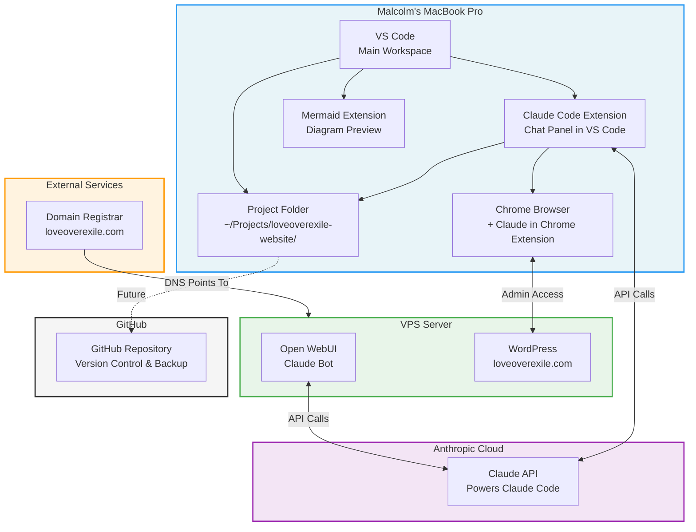

# Technical Architecture — Love Over Exile

> **Last updated:** 2026-02-27
> **Status:** Initial setup
>
> This diagram shows every technical component, connection, and platform involved in this project.
> Updated every time we add, change, or remove something.

## System Overview Diagram

## Component Registry

| # | Component | What It Is | Where It Lives | Installed On |
|---|-----------|-----------|----------------|--------------|
| 1 | VS Code | Code editor — main workspace | Applications | MacBook Pro |
| 2 | Claude Code Extension | AI chat panel inside VS Code | VS Code extension | MacBook Pro |
| 3 | Mermaid Extension | Renders architecture diagrams in VS Code | VS Code extension | MacBook Pro |
| 4 | Claude Code v2.1.62 | AI coding assistant (CLI) | ~/.local/bin/claude | MacBook Pro |
| 5 | Project Folder | Local workspace for this project | ~/Projects/loveoverexile-website/ | MacBook Pro |
| 6 | Chrome + Claude Extension | Browser with AI integration | MacBook Pro | MacBook Pro |
| 7 | WordPress | Website CMS | VPS Server | VPS |
| 8 | Open WebUI | Chat interface for Claude | VPS Server | VPS |
| 9 | Claude API (Anthropic) | AI model powering Claude Code & Open WebUI | Anthropic Cloud | Cloud |
| 10 | Domain: loveoverexile.com | Domain name | Domain Registrar | External |
| 11 | GitHub Repository | Version control & backup (NOT YET SET UP) | github.com | Cloud |
| 12 | GitHub CLI (gh) v2.87.3 | Manage GitHub from terminal | /opt/homebrew/bin/gh | MacBook Pro |

## Connections & Data Flow

| From | To | How | Purpose |
|------|----|-----|---------|
| Terminal | Claude Code | CLI command `claude` | Start AI assistant |
| Claude Code | Claude API | HTTPS API calls | AI processing |
| Claude Code | Project Folder | File read/write | Manage content & docs |
| Chrome | WordPress Admin | HTTPS (wp-admin) | Edit website |
| Open WebUI | Claude API | HTTPS API calls | VPS-based AI chat |
| Domain Registrar | VPS | DNS records | Route loveoverexile.com to server |

## Authentication Points

| Service | Auth Method | Status | Notes |
|---------|------------|--------|-------|
| Claude Code | Anthropic account login | Active | Authenticated on MacBook |
| WordPress Admin | Username + password | TBD | Need to set up application password for API access |
| Open WebUI | TBD | Active | Running on VPS |
| Domain Registrar | TBD | Active | Malcolm manages |

---

## Change Log

| Date | What Changed | Diagram Updated |
|------|-------------|-----------------|
| 2026-02-27 | Initial setup — Claude Code installed on MacBook, project folder created | Yes — initial diagram |
| 2026-02-27 | Added VS Code, Mermaid extension, Claude Code extension, GitHub CLI. Added GitHub (future) to diagram | Yes |
