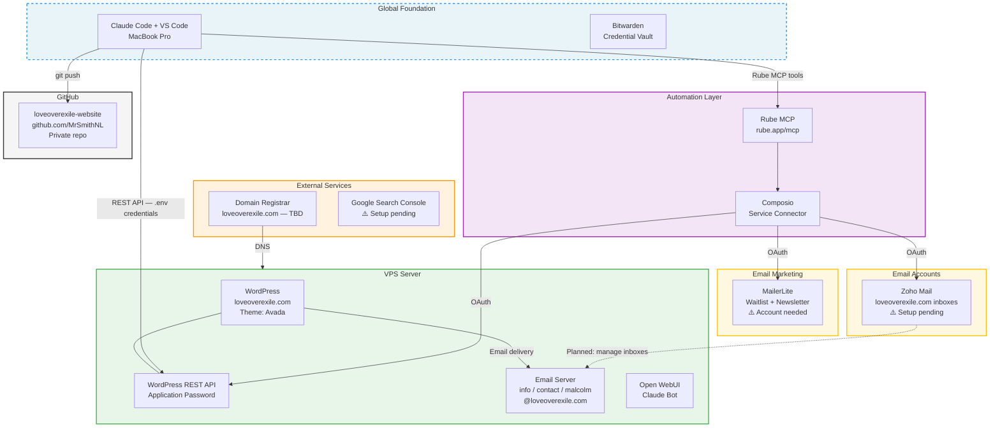

# Project Architecture — Love Over Exile

> **Scope: Project-specific — components unique to loveoverexile.com.**
> This project is built on the global foundation. See `~/.claude/docs/architecture.md` for the shared tooling layer (Claude Code, VS Code, Bitwarden, GitHub CLI, etc.).
>
> **Last updated:** 2026-02-27
> **Status:** Active — content workflow live, Rube MCP configured, email accounts created, Privacy Policy published

---

## Project System Diagram



---

## Components

| # | Component | What It Is | Where It Lives | Status |
|---|-----------|-----------|----------------|--------|
| 1 | WordPress | Website CMS — Avada theme | VPS Server | ✅ Active |
| 2 | WordPress REST API | Programmatic content management | VPS Server | ✅ Active — credentials in .env |
| 3 | Email Server | loveoverexile.com mailboxes | VPS Server | ✅ Active — info, contact, malcolm |
| 4 | Rube MCP | Bridge connecting Claude to external services | rube.app/mcp | ✅ Configured in ~/.claude.json |
| 5 | Composio | OAuth connector for external service APIs | Via Rube MCP | ⚠️ Configured — services not yet connected |
| 6 | Zoho Mail | Manages loveoverexile.com inboxes with full API | Zoho cloud | ⚠️ Account needed — will connect via Composio |
| 7 | MailerLite | Email waitlist + newsletter for book launch | MailerLite cloud | ⚠️ Account needed — will connect via Composio |
| 8 | Google Search Console | SEO monitoring and indexing | Google | ⚠️ Setup pending |
| 9 | Open WebUI | Self-hosted AI chat interface | VPS Server | ❓ Status TBD |
| 10 | VPS Server | Hosts WordPress + email + Open WebUI | Cloud — provider TBD | ✅ Active |
| 11 | Domain — loveoverexile.com | Domain name + DNS | Registrar TBD | ✅ Active |
| 12 | GitHub Repo | Version control and project backup | github.com/MrSmithNL | ✅ Active — private |

---

## Connections

| From | To | How | Status | Purpose |
|------|----|-----|--------|---------|
| Claude Code | WordPress REST API | HTTPS + Application Password (.env) | ✅ Active | Push content, publish pages, manage posts |
| Claude Code | Rube MCP | HTTP MCP server | ✅ Configured — needs VS Code reload | Gateway to all Composio automations |
| Composio | Zoho Mail | OAuth | ⚠️ Pending connection | Read, send, monitor loveoverexile.com inboxes |
| Composio | MailerLite | OAuth | ⚠️ Pending connection | Manage waitlist subscribers and campaigns |
| Project folder | GitHub | git push via CLI | ✅ Active | Version control + backup |
| Domain Registrar | VPS | DNS records | ✅ Active | Routes loveoverexile.com to server |

---

## Authentication

| Service | Auth Method | Status | Where Stored |
|---------|------------|--------|-------------|
| WordPress REST API | Application Password | ✅ Active | `.env` file (gitignored) + Bitwarden |
| WordPress Admin | Username + password | ✅ Active | Bitwarden |
| GitHub | OAuth via GitHub CLI | ✅ Active | macOS keyring |
| Rube MCP | No auth — open endpoint | ✅ Configured | `~/.claude.json` |
| Composio | Per-service OAuth tokens | ⚠️ Pending | Managed by Composio |
| Zoho Mail | OAuth via Composio | ⚠️ Pending | Composio |
| MailerLite | OAuth via Composio | ⚠️ Pending | Composio |
| Email server (VPS) | TBD | ✅ Accounts created | Malcolm manages |
| Domain Registrar | TBD | ✅ Active | Malcolm manages |
| VPS Server | TBD (SSH / control panel) | ✅ Active | Malcolm manages |
| Open WebUI | TBD | ❓ Unknown | TBD |
| Google Search Console | Google OAuth | ⚠️ Not yet set up | TBD |

---

## Accounts

| Service | URL | Purpose | Account |
|---------|-----|---------|---------|
| WordPress Admin | https://loveoverexile.com/wp-admin | Manage website | loveoverexile (user) |
| GitHub | https://github.com/MrSmithNL | Version control | MrSmithNL |
| Bitwarden | https://vault.bitwarden.com | Credential vault | msmithnl@gmail.com |
| Rube / Composio | https://rube.app | Automation bridge | No account needed |
| Zoho Mail | https://mail.zoho.com | Email management | ⚠️ To be created |
| MailerLite | https://mailerlite.com | Email marketing | ⚠️ To be created |
| Google Search Console | https://search.google.com/search-console | SEO monitoring | ⚠️ To be set up |
| VPS Provider | TBD | Server management | Malcolm |
| Domain Registrar | TBD | DNS + renewal | Malcolm |

---

## Content Workflow (built 2026-02-27)

```
Write Markdown file locally
    ↓ (content/pages/ or content/posts/)
python3 scripts/push-to-wordpress.py <file>
    ↓ (REST API → WordPress draft)
Preview at wp-admin link (must be logged in)
    ↓ (Malcolm reviews)
Publish via REST API or wp-admin
```

Scripts: `scripts/push-to-wordpress.py`
Docs: `docs/content-workflow.md`

---

## Pages Live on Site

| Page | URL | Status |
|------|-----|--------|
| Privacy Policy | https://loveoverexile.com/privacy-policy/ | ✅ Published |
| All other pages | — | ⚠️ Demo content — to be replaced |

---

## Change Log

| Date | What Changed | Diagram Updated |
|------|-------------|----------------|
| 2026-02-27 | Initial setup — Claude Code, VS Code, GitHub, Bitwarden, WordPress REST API | Yes |
| 2026-02-27 | Site purpose clarified — book platform + parental alienation community | No |
| 2026-02-27 | Book manuscript read, memory file written, site structure designed | No |
| 2026-02-27 | Content workflow built — push script, folder structure, Privacy Policy published | No |
| 2026-02-27 | File permissions configured — Read/Edit/Write auto-approved in settings.json | No |
| 2026-02-27 | Rube MCP configured in ~/.claude.json — gateway to Composio integrations | Yes |
| 2026-02-27 | Email accounts created on VPS: info, contact, malcolm @loveoverexile.com | Yes |
