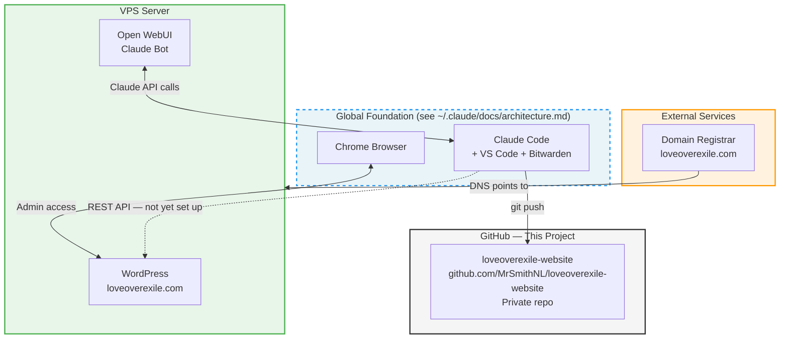

# Project Architecture — Love Over Exile

> **Scope: Project-specific — components unique to loveoverexile.com.**
> This project is built on the global foundation. See `~/.claude/docs/architecture.md` for the shared tooling layer (Claude Code, VS Code, Bitwarden, GitHub CLI, etc.).
>
> **Last updated:** 2026-02-27
> **Status:** Active — local environment complete, GitHub connected, Bitwarden active, WordPress API pending

---

## Project System Diagram

---

## Project-Specific Components

| # | Component | What It Is | Where It Lives | Status |
|---|-----------|-----------|----------------|--------|
| 1 | WordPress | Website CMS — loveoverexile.com | VPS Server | Active |
| 2 | Open WebUI | Self-hosted AI chat interface | VPS Server | Active |
| 3 | VPS Server | Hosts WordPress + Open WebUI | Cloud (provider TBD) | Active |
| 4 | Domain — loveoverexile.com | Domain name | Domain Registrar (TBD) | Active |
| 5 | GitHub Repo | Version control and backup for this project | github.com/MrSmithNL/loveoverexile-website | Active — private |

---

## Project-Specific Connections

| From | To | How | Status | Purpose |
|------|----|-----|--------|---------|
| Project Folder | GitHub Repo | git push (via GitHub CLI) | Active | Version control and offsite backup |
| Chrome Browser | WordPress Admin | HTTPS (wp-admin) | Active | Edit website content |
| Claude Code | WordPress REST API | HTTPS + Application Password | Not yet set up | Programmatic content management |
| Domain Registrar | VPS | DNS records | Active | Routes loveoverexile.com to server |
| Open WebUI | Claude API | HTTPS | Active | VPS-based AI chat interface |

---

## Project-Specific Authentication

| Service | Auth Method | Status | Notes |
|---------|------------|--------|-------|
| WordPress Admin | Username + password | Active — login TBD | Need to confirm credentials in Bitwarden |
| WordPress REST API | Application password | Not yet set up | See RISK-002 in security-risk-log.md |
| Open WebUI | TBD | Active | Running on VPS |
| Domain Registrar | TBD | Active | Malcolm manages directly |
| VPS Server | TBD (SSH / control panel) | Active | Malcolm manages directly |

---

## Project-Specific Accounts

| Service | URL | Purpose | Credentials |
|---------|-----|---------|-------------|
| WordPress Admin | https://loveoverexile.com/wp-admin | Manage website content | Bitwarden |
| VPS Provider | TBD | Server management | Bitwarden |
| Domain Registrar | TBD | DNS and domain renewal | Bitwarden |

---

## Change Log

| Date | What Changed | Diagram Updated |
|------|-------------|----------------|
| 2026-02-27 | Initial setup — Claude Code installed on MacBook, project folder created | Yes — initial diagram |
| 2026-02-27 | Added VS Code, Mermaid extension, Claude Code extension, GitHub CLI | Yes |
| 2026-02-27 | GitHub account created (MrSmithNL), repo pushed | Yes |
| 2026-02-27 | Bitwarden desktop installed, bwunlock workflow added | Yes |
| 2026-02-27 | Refactored — global components moved to ~/.claude/docs/architecture.md; this file now shows project-specific layer only | Yes |
