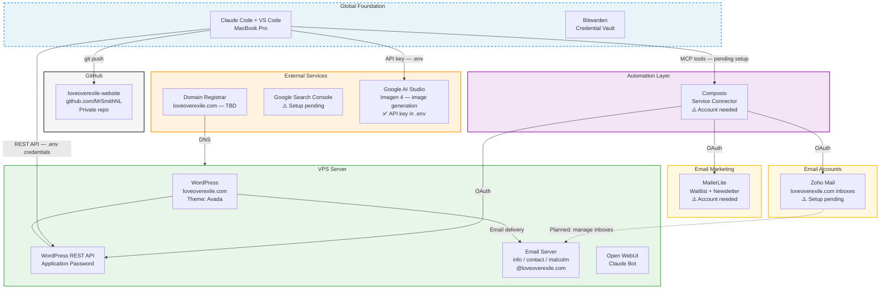

# Project Architecture — Love Over Exile

> **Scope: Project-specific — components unique to loveoverexile.com.**
> This project is built on the global foundation. See `~/.claude/docs/architecture.md` for the shared tooling layer (Claude Code, VS Code, Bitwarden, GitHub CLI, etc.).
>
> **Last updated:** 2026-02-28
> **Status:** Active — Astro site built (18 pages, zero errors), pushed to GitHub. WordPress archived. Vercel deploy pending Malcolm login. Images pending Imagen 4 generation.

---

## Project System Diagram



---

## Components

| # | Component | What It Is | Where It Lives | Status |
|---|-----------|-----------|----------------|--------|
| 1 | **Astro Site** | New website (replaces WordPress) | `site/` in GitHub repo | ✅ Built — 18 pages, awaiting Vercel deploy |
| 2 | Vercel | Hosting + CDN + auto-deploy from GitHub | vercel.com | ⚠️ Account needed — Malcolm logs in with `vercel login` |
| 3 | WordPress | Old website (Avada theme) — to be archived | VPS Server | ⚠️ Will become classic.loveoverexile.com after DNS cutover |
| 4 | WordPress REST API | Programmatic content management (old) | VPS Server | 🔜 No longer primary — Astro replaces this |
| 5 | Email Server | loveoverexile.com mailboxes | VPS Server | ✅ Active — info, contact, malcolm |
| 6 | Composio | OAuth connector for external service APIs | composio.dev | ⚠️ Account needed |
| 7 | Zoho Mail | Manages loveoverexile.com inboxes | Zoho cloud | ⚠️ Account needed |
| 8 | MailerLite | Email waitlist + newsletter for book launch | MailerLite cloud | ⚠️ Account needed |
| 9 | Google Analytics 4 | Website analytics | Google | ⚠️ Malcolm needs to create property + get Measurement ID |
| 10 | Google Search Console | SEO monitoring and indexing | Google | ⚠️ Setup pending after DNS cutover |
| 11 | VPS Server | Hosts WordPress + email | Cloud — provider TBD | ✅ Active |
| 12 | Domain — loveoverexile.com | Domain name + DNS | GoDaddy | ✅ Active — DNS cutover to Vercel pending |
| 13 | GitHub Repo | Version control and auto-deploy trigger | github.com/MrSmithNL | ✅ Active — private |
| 14 | Google AI Studio (Imagen 4) | AI image generation for website | Google cloud | ✅ Active — API key in .env |
| 15 | Discourse | Community forum (coming later) | Dedicated VPS (Hetzner ~4 GB) | 🔜 Planned — after site is live |
| 16 | Ayrshare | Social media posting API | ayrshare.com | 🔜 Planned — after site is live |
| 17 | n8n | Automation: RSS → Claude → social pipeline | Self-hosted on VPS | 🔜 Planned — after site is live |

---

## Connections

| From | To | How | Status | Purpose |
|------|----|-----|--------|---------|
| Claude Code | WordPress REST API | HTTPS + Application Password (.env) | ✅ Active | Push content, publish pages, manage posts |
| Claude Code | Google AI Studio | HTTPS + API Key (.env) | ✅ Active | Generate images with Imagen 4 |
| Claude Code | Composio MCP | HTTP MCP server | ⚠️ Pending — account needed | Gateway to Zoho Mail + MailerLite automations |
| Composio | Zoho Mail | OAuth | ⚠️ Pending connection | Read, send, monitor loveoverexile.com inboxes |
| Composio | MailerLite | OAuth | ⚠️ Pending connection | Manage waitlist subscribers and campaigns |
| Project folder | GitHub | git push via CLI | ✅ Active | Version control + backup |
| Domain Registrar | VPS | DNS records | ✅ Active | Routes loveoverexile.com to server |

---

## Authentication

| Service | Auth Method | Status | Where Stored |
|---------|------------|--------|-------------|
| WordPress REST API | Application Password | ✅ Active | `.env` file (gitignored) + Bitwarden |
| WordPress Admin | Username + password | ✅ Active | Bitwarden |
| GitHub | OAuth via GitHub CLI | ✅ Active | macOS keyring |
| Rube MCP | N/A — removed | ❌ Removed | Deleted from `~/.claude.json` |
| Composio | Per-service OAuth tokens | ⚠️ Pending | Managed by Composio |
| Zoho Mail | OAuth via Composio | ⚠️ Pending | Composio |
| MailerLite | OAuth via Composio | ⚠️ Pending | Composio |
| Email server (VPS) | TBD | ✅ Accounts created | Malcolm manages |
| Domain Registrar | TBD | ✅ Active | Malcolm manages |
| VPS Server | TBD (SSH / control panel) | ✅ Active | Malcolm manages |
| Open WebUI | TBD | ❓ Unknown | TBD |
| Google Search Console | Google OAuth | ⚠️ Not yet set up | TBD |
| Google AI Studio | API Key | ✅ Active | `.env` file (gitignored) + Bitwarden |

---

## Accounts

| Service | URL | Purpose | Account |
|---------|-----|---------|---------|
| WordPress Admin | https://loveoverexile.com/wp-admin | Manage website | loveoverexile (user) |
| GitHub | https://github.com/MrSmithNL | Version control | MrSmithNL |
| Bitwarden | https://vault.bitwarden.com | Credential vault | msmithnl@gmail.com |
| Composio | https://composio.dev | Automation bridge | ⚠️ Account to be created |
| Zoho Mail | https://mail.zoho.com | Email management | ⚠️ To be created |
| MailerLite | https://mailerlite.com | Email marketing | ⚠️ To be created |
| Google Search Console | https://search.google.com/search-console | SEO monitoring | ⚠️ To be set up |
| Google AI Studio | https://aistudio.google.com | Imagen 4 API for image generation | msmithnl@gmail.com |
| VPS Provider | TBD | Server management | Malcolm |
| Domain Registrar | TBD | DNS + renewal | Malcolm |

---

## Image Workflow (built 2026-02-27)

```
Define images needed for a page
    ↓ (prompts, aspect ratios, SEO filenames)
python3 scripts/generate-images.py
    ↓ (Imagen 4 → Pillow optimise → WordPress media upload)
Image URLs returned → inserted into Avada shortcodes
    ↓ (REST API → WordPress draft)
Preview at wp-admin link
```

Scripts: `scripts/generate-images.py`
Skill: `~/.claude/skills/loe-image-generator/SKILL.md`
Optimisation targets: 16:9 backgrounds < 150 KB, cards < 90 KB, inline < 90 KB, mobile hero < 100 KB

---

## Content Workflow (built 2026-02-27)

```
Write Markdown file locally
    ↓ (content/pages/ or content/posts/)
python3 scripts/push-to-wordpress.py <file>
    ↓ (REST API → WordPress draft)
Preview at wp-admin link (must be logged in)
    ↓ (Malcolm reviews)
Publish via REST API or wp-admin
```

Scripts: `scripts/push-to-wordpress.py`
Docs: `docs/content-workflow.md`

---

## Astro Site Pages (built 2026-02-28)

All pages live in `site/src/pages/`. Built with Astro v5.18.0 + Tailwind CSS v4.

| Page | Route | Status |
|------|-------|--------|
| Homepage | `/` | ✅ Built — 10 sections |
| The Book | `/the-book` | ✅ Built — waitlist + 3-part breakdown |
| About the Author | `/about` | ✅ Built — Malcolm's story |
| Articles index | `/articles` | ✅ Built — placeholder articles |
| Article template | `/articles/[slug]` | ✅ Built — ready for Sanity CMS |
| Community | `/community` | ✅ Built — forum categories + join CTA |
| Free Guide | `/free-guide` | ✅ Built — download landing page |
| You Are Not Alone | `/you-are-not-alone` | ✅ Built — PA statistics |
| FAQ | `/faq` | ✅ Built — 2 sections (LOE + PA) |
| Contact | `/contact` | ✅ Built — form + crisis note |
| Understanding PA | `/understanding` | ✅ Built — Part I hub |
| Survival Guide | `/survival-guide` | ✅ Built — Part II hub |
| Inner Freedom | `/inner-freedom` | ✅ Built — Part III hub |
| Resources | `/resources` | ✅ Built — books + orgs |
| Start Here | `/start-here` | ✅ Built — curated entry point |
| Privacy Policy | `/privacy-policy` | ✅ Built — updated for Astro site |

**Images:** `/public/images/` folder created. Real images pending Imagen 4 generation.

## Old WordPress Pages

| Page | URL | Status |
|------|-----|--------|
| Privacy Policy | https://loveoverexile.com/privacy-policy/ | ✅ Published (WordPress) |
| Home | https://loveoverexile.com/ | ⚠️ Draft — will be replaced by Astro |
| The Book | https://loveoverexile.com/the-book/ | ⚠️ Draft |
| Malcolm's Story | https://loveoverexile.com/about-us/ | ⚠️ Draft |
| All other pages | — | ⚠️ Demo content |

---

## Change Log

| Date | What Changed | Diagram Updated |
|------|-------------|----------------|
| 2026-02-27 | Initial setup — Claude Code, VS Code, GitHub, Bitwarden, WordPress REST API | Yes |
| 2026-02-27 | Site purpose clarified — book platform + parental alienation community | No |
| 2026-02-27 | Book manuscript read, memory file written, site structure designed | No |
| 2026-02-27 | Content workflow built — push script, folder structure, Privacy Policy published | No |
| 2026-02-27 | File permissions configured — Read/Edit/Write auto-approved in settings.json | No |
| 2026-02-27 | Rube MCP configured in ~/.claude.json — gateway to Composio integrations | Yes |
| 2026-02-27 | Email accounts created on VPS: info, contact, malcolm @loveoverexile.com | Yes |
| 2026-02-27 | Rube MCP removed — auth model changed, broken. Composio direct setup needed instead. | Yes |
| 2026-02-27 | Google AI Studio added — Imagen 4 API key stored in .env. loe-image-generator skill created. | Yes |
| 2026-02-27 | Home page updated — LOE text content + 13 Imagen 4 images generated, optimised, and pushed as draft (ID 1023) | No |
| 2026-02-27 | Malcolm's Story page — About Us (ID 1887) replaced with full LOE narrative content across all 6 Avada sections (53 replacements). Script: scripts/replace-about-us.py | No |
| 2026-02-28 | **Major pivot** — Abandoned WordPress/Avada. Decided to build from scratch with Astro. Design brief written (`docs/site-design-brief.md`). | No |
| 2026-02-28 | Full Astro site built — 18 pages, design system (Tailwind v4 + CSS custom properties), Nav + Footer components, BaseLayout with SEO/OG/JSON-LD. | Yes |
| 2026-02-28 | Astro config updated — site URL set, sitemap integration working, generates sitemap-index.xml. Build passes zero errors. Pushed to GitHub. | Yes |
